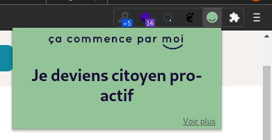

# Extension Chrome "Ça commence par moi"

Extension Chrome qui affiche une bonne action à réaliser pour l'environnement :seedling:

L'extension affiche un article du site [cacommenceparmoi.org](https://cacommenceparmoi.org/) aléatoirement.



## Installation

Télécharger [le projet](https://github.com/romdum/cacommenceparmoi-chrome/archive/refs/heads/main.zip).

Dans votre navigateur Chrome, rendez-vous sur l'URL [chrome://extensions](chrome://extensions), activer le mode développeur en haut à droite, cliquer sur "Charger l'extension non empaquetée" et renseigner le répertoire du projet.

## Développement

Pour mettre à jour les articles, exécuter la commande :
```
wget https://cacommenceparmoi.org/action-sitemap.xml
```
